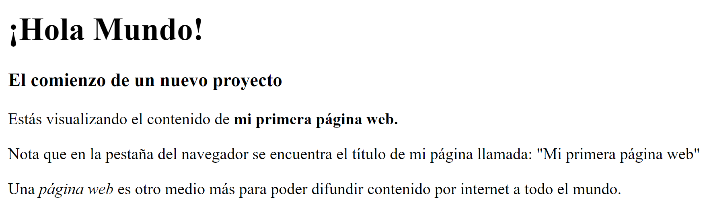
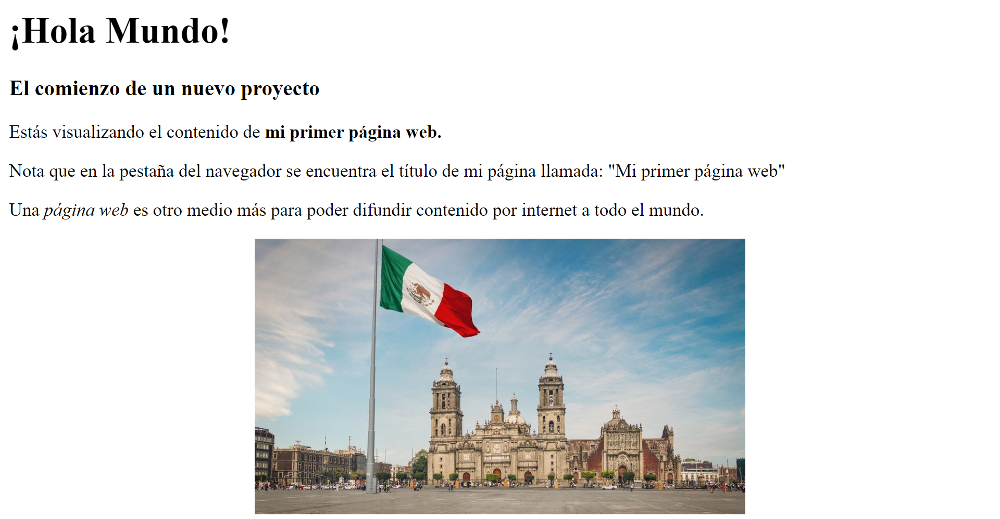

# Crear Primera Página Web
1. Para comenzar, ubica en el ambiente del sistema operativo un lugar donde puedas crear una carpeta nueva y creala. Podrías poner como nombre a la nueva carpeta "Pagina_web". Aqui almacenaremos un archivo de bloq de notas.
    __Se recomienda no utilizar espacios en el nombramiento de directorios y archivos__

1. En el archivo de bloq de notas coloca el siguiente código
    

```html
    <!DOCTYPE html>
    <html>

    <head>
        <title>Mi primera página web</title>
    </head>

    <body>
        <h1>¡Hola Mundo!</h1>
        <h3>El comienzo de un nuevo proyecto</h3>
        <p>Estás visualizando el contenido de <strong> mi primera página web.</strong></p>
        <p>Nota que en la pestaña del navegador se encuentra el título de mi página llamada:
            "Mi primera página web"</p>
        <p>Una <i>página web</i> es otro medio más para poder difundir contenido por
            internet a todo el mundo.</p>
    </body>

    </html>
```

1. Guarda el archivo en la carpeta que creaste, agregando al final la extención html. En este ejemplo puedes llamar al archivo index.html

1. Podras ejecutar dando doble click o abriendo desde el navegador.



## Agregar una imagen
Las imágenes son fundamentales para que una página web sea más atractiva. Son el primer contenido no textual que se planteó poder incorporar al estándar HTML. Prácticamente no hay páginas sin imágenes.

Los navegadores tienen capacidad de mostrar imágenes, pero sólo las que pertenezcan a tipos concretos. Los tipos de imágenes reconocidos por la mayoría de navegadores son: __jpg,png,gif,webp y SVG.__

Si quisieramos agregar una imagen al contenido que hemos publicado, precedemos como sigue:

1. Dentro de la carpeta raiz crearemos la carpeta img, dentro de ella coloca la imagen que quieres mostrar.

1. Modifica el código html agregando las lineas de código html

    ```html
    <!DOCTYPE html>
    <html>

    <head>
        <title>Mi primer página web</title>
        <style>
            img {
                display: block;
                margin: auto;
                width: 50%;
            }
        </style>
    </head>

    <body>
        <h1>¡Hola Mundo!</h1>
        <h3>El comienzo de un nuevo proyecto</h3>
        <p>Estás visualizando el contenido de <strong>mi primer página web.</strong></p>
        <p>Nota que en la pestaña del navegador se encuentra el título de mi página llamada:
            "Mi primer página web"</p>
        <p>Una <i>página web</i> es otro medio más para poder difundir contenido por
            internet a todo el mundo.</p>
        
    </body>

    </html>
    ```

    Guarda las modificaciones del archivo que contiene el código html. Refresca o cierra y
    abre la ventana del explorador que muestra el contenido de tu página web. Deberás
    visualizar algo como lo que sigue:
    

