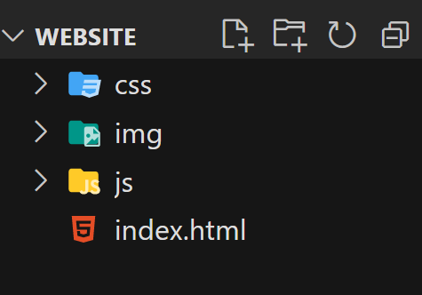

# Estructura básica de carpetas / archivos del sitio web

Un sitio web consta de muchos archivos: contenido de texto, código, hojas de estilo, contenido multimedia, etc. Cuando está creando un sitio web, debes tener estos archivos en una estructura fisica en tu computadora local, asegurarse de que puedan comunicarse entre sí y hacer que todo su contenido se vea bien antes de que finalmente los cargue en un servidor. Tratar con archivos analiza algunos problemas que debes tener en cuenta para que puedas configurar una estructura de archivos sensata para su sitio web.

Cuando trabaja en un sitio web localmente en su computadora, debe mantener todos los archivos relacionados en una sola carpeta que refleje la estructura de archivos del sitio web publicado en el servidor.

# Espaciado y sensibilidad de mayúsculas y minúsculas

1. Muchas computadoras, particularmente los servidores web, distinguen entre mayúsculas y minúsculas. Entonces, por ejemplo, si coloca una imagen en su sitio web test-site/MyImage.jpgy luego en un archivo diferente intenta invocar la imagen como test-site/myimage.jpg, es posible que no funcione.

2. Los navegadores, los servidores web y los lenguajes de programación no manejan los espacios de manera consistente. Por ejemplo, si usa espacios en su nombre de archivo, algunos sistemas pueden tratar el nombre de archivo como dos nombres de archivo. Algunos servidores reemplazarán los espacios con "%20" (el código de carácter para los espacios en las URL), lo que provocará que todos sus enlaces se rompan. Es mejor separar las palabras con guiones.

# Estructura de un sitio web
Cuando estemos creando una web siempre partiremos de una carpeta raíz  que contendrá archivos y otras carpetas.

__Nota:Todos los archivos y carpetas deben: estar en minúsculas, no tener espacios en el nombre, comenzar con una letra o un número y no con un carácter especial.__

* __Carpeta (raiz) del proyecto__:esta es la carpeta principal del proyecto y contiene TODOS los demás archivos y carpetas. En la web se llama la carpeta raíz .

* __index__: este archivo generalmente contendrá el contenido de su página de inicio.  Cuando estemos creando una web siempre partiremos de una carpeta raíz  que contendrá archivos y otras carpetas. Uno de esos archivos es el documento HTML llamado index.html que representa la página inicial de nuestro sitio web, es decir, la que se mostrará por defecto cuando un usuario nos visite. La razón por la cual debe llamarse index.html es debido a una convención que comparten todos los servidores web. Así, cuando accedemos a: ejemplo.com en realidad nos está mostrando: ejemplo.com/index.html.

* __img,image.imagenes__: Esta carpeta contendrá todas las imágenes que usas en tu sitio.
* __css,styles__: Esta carpeta contendra el código CSS utilizado para diseñar su contenido, establecer colores de fondo y texto, etc.
* __script,js__: esta carpeta contendra todo el código JavaScript utilizado para agregar funcionalidad interactivia a un sitio (por ejemplo, botones que cargan datos cuando se hace clic en ellos).

